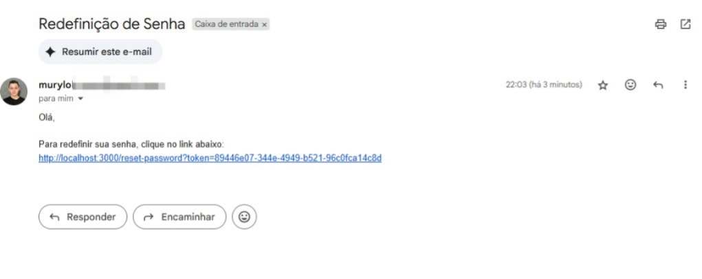

# Sistema de Autenticação - API (Back-end)


## 📖 Sobre o Projeto

API RESTful completa para autenticação e autorização de usuários, desenvolvida com o ecossistema Spring. O objetivo deste projeto é demonstrar habilidades em segurança de APIs com JWT, boas práticas de desenvolvimento back-end, gerenciamento de acesso por papéis (Roles), funcionalidades essenciais como recuperação de senha e a garantia de qualidade através de testes unitários.

Este projeto é o back-end de um sistema full-stack. O front-end em React pode ser encontrado [aqui](link-para-seu-futuro-repo-do-front).

---

## 🛠️ Tecnologias Utilizadas

- **Java 17**: Versão LTS do Java, garantindo performance e segurança.
- **Spring Boot 3+**: Framework principal para a criação da aplicação.
- **Spring Security**: Para a camada de segurança e controle de acesso.
- **JWT (JSON Web Token)**: Para a autenticação stateless da API, utilizando a biblioteca `jjwt`.
- **Spring Data JPA**: Para a persistência de dados de forma simplificada.
- **Spring Boot Starter Mail**: Para o envio de e-mails.
- **Maven**: Gerenciador de dependências do projeto.
- **H2 Database**: Banco de dados em memória para o ambiente de desenvolvimento.
- **Lombok**: Para reduzir a verbosidade do código Java.
- **JUnit 5 & Mockito**: Para a implementação de testes unitários robustos, garantindo a qualidade do código.

---

## ✅ Funcionalidades Implementadas

- [x] **Endpoints de Autenticação**:
    - [x] `POST /api/auth/signup`: Registro de novos usuários com validação de dados e criptografia de senha (BCrypt).
    - [x] `POST /api/auth/signin`: Login de usuários e geração de token de acesso JWT.
- [x] **Controle de Acesso por Papéis**:
    - [x] Distinção entre usuários comuns (`ROLE_USER`) e administradores (`ROLE_ADMIN`).
    - [x] Proteção de endpoints específicos por papel utilizando `@PreAuthorize`.
- [x] **Recuperação de Senha Completa**:
    - [x] `POST /api/auth/forgot-password`: Envio de e-mail com token de recuperação de uso único.
    - [x] `POST /api/auth/reset-password`: Redefinição da senha com validação de token e tempo de expiração.
- [x] **Testes Unitários**:
    - [x] A camada de serviço (`Service Layer`) possui cobertura de testes unitários para garantir que a lógica de negócio opere corretamente, de forma isolada.
    - [x] Utilização de **Mockito** para simular (`mock`) as dependências externas (como `UserRepository` e `EmailService`), permitindo que a lógica seja testada sem a necessidade de um banco de dados ou servidor de e-mail real.

---

## 🚀 Como Executar o Projeto

Para executar este projeto localmente, siga os passos abaixo.

### Pré-requisitos

-   [Git](https://git-scm.com/)
-   [Java JDK 17](https://www.oracle.com/java/technologies/javase/jdk17-archive-downloads.html)
-   [Apache Maven](https://maven.apache.org/download.cgi)
-   Uma conta Gmail com uma **Senha de App** gerada (para a funcionalidade de envio de e-mail).

### 1. Clone o Repositório

```bash
git clone https://github.com/murylomarques/sistema-autenticação-api.git
cd sistema-autenticação-api
```

### 2. Configure as Variáveis de Ambiente

O passo mais importante é configurar suas credenciais de e-mail. Abra o arquivo `src/main/resources/application.properties` e edite as seguintes linhas com suas informações:

```properties
# CONFIGURAÇÕES DE E-MAIL (SMTP)
spring.mail.host=smtp.gmail.com
spring.mail.port=587
spring.mail.username=seu-email@gmail.com
spring.mail.password=sua-senha-de-app-de-16-digitos
spring.mail.properties.mail.smtp.auth=true
spring.mail.properties.mail.smtp.starttls.enable=true
```

### 3. Execute a Aplicação e os Testes

**Para iniciar a aplicação:**

```bash
mvn spring-boot:run
```
A API estará disponível em `http://localhost:8080`.

**Para rodar os testes unitários:**

```bash
mvn test
```
Este comando executará todos os testes do projeto e mostrará um `BUILD SUCCESS` se todos passarem.

---

## ✨ Demonstração

Abaixo, um exemplo do e-mail de recuperação de senha enviado pela aplicação, confirmando que a integração com o servidor SMTP está funcionando.

